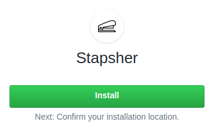

Stapsher's Public API uses a GitHub App for managing your site's repository on GitHub.

## Step 1: Install Stapsher GitHub App

Login on GitHub and visit the Stapsher GitHub App page:

<a class="button is-large" href='https://github.com/apps/stapsher' target='_blank'>
  
    <i class="fab fa-github"></i>
  
  Stapsher GitHub App
</a>

You should see the **Install** button.

Hit it and follow the instructions.

You can give Stapsher permission to access all your repository or only select a few, it's up to you.

And, that's it!

## Step 2: Add configuration file: `stapsher.yaml`

Stapsher looks for `stapsher.yaml` at the root of your site's repository. You can fine-tune Stapsher's behavior in this file.

Take a look at the sample configuration file: <a class="tag is-link is-medium" href=''>stapsher.yaml Sample</a>

You can use it as is. Or change and extend it according to your need.

You can find all the available configuration options here: <a class="tag is-link is-medium" href=''>stapsher.yaml Options</a>

## Step 3: Prepare your HTML Forms

For using Stapsher with your site's HTML Forms, check:

<a class="tag is-link is-large" href=''>Usage with HTML Forms</a>

---

You're all set!
