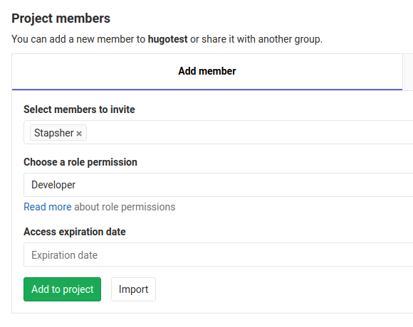

Stapsher's Public API uses a GitLab Bot account for managing your site's repository on GitLab.

## Step 1: Add `stapsher` as a project member

Go to your GitLab project's **Settings** > **Members** > **Add member**:

Add `stapsher` as a member with minimum role permission of **_Developer_**.

If you're using a [Protected branch](https://docs.gitlab.com/ce/user/project/protected_branches.html#using-the-allowed-to-merge-and-allowed-to-push-settings), make sure `stapsher` is allowed to push.

## Step 2: Add configuration file: `stapsher.yaml`

Stapsher looks for `stapsher.yaml` at the root of your site's repository. You can fine-tune Stapsher's behavior in this file.

Take a look at the sample configuration file: <a class="tag is-link is-medium" href=''>stapsher.yaml Sample</a>

You can use it as is. Or change and extend it according to your need.

You can find all the available configuration options here: <a class="tag is-link is-medium" href=''>stapsher.yaml Options</a>

## Step 3: Prepare your HTML Forms

For using Stapsher with your site's HTML Forms, check:

<a class="tag is-link is-large" href=''>Usage with HTML Forms</a>

---

You're all set!
